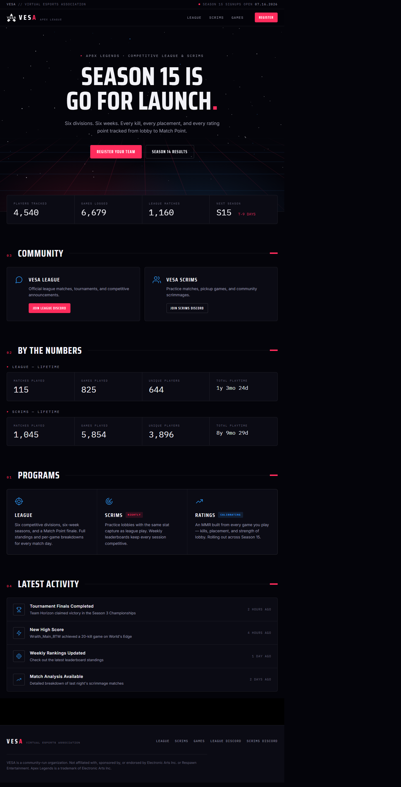
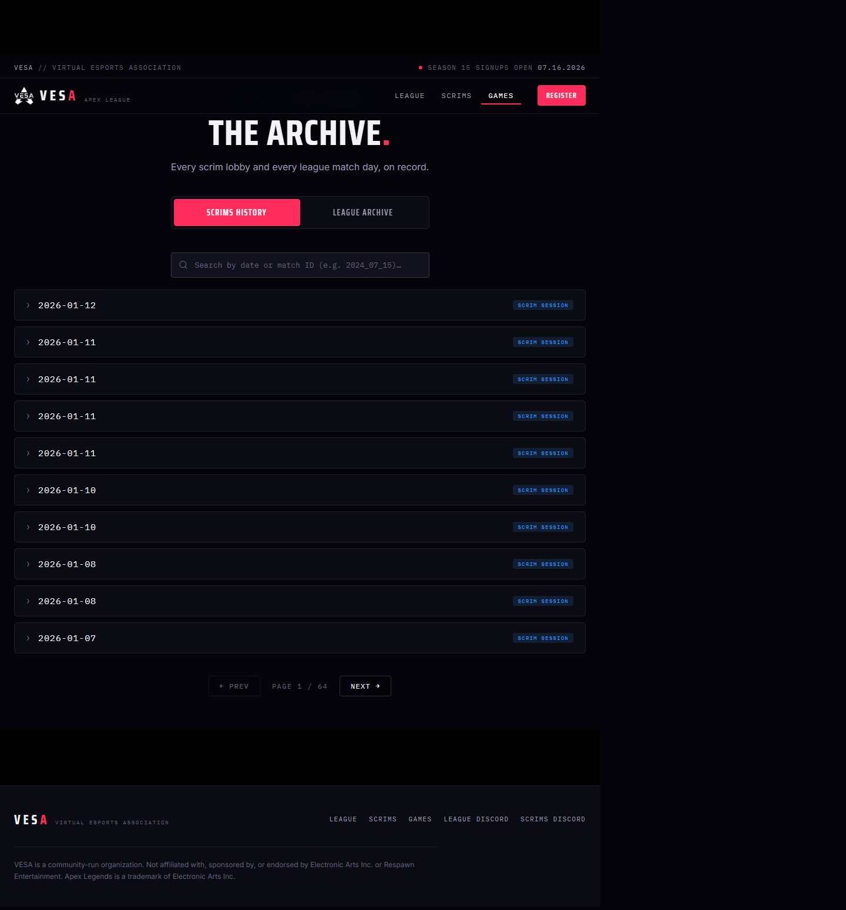
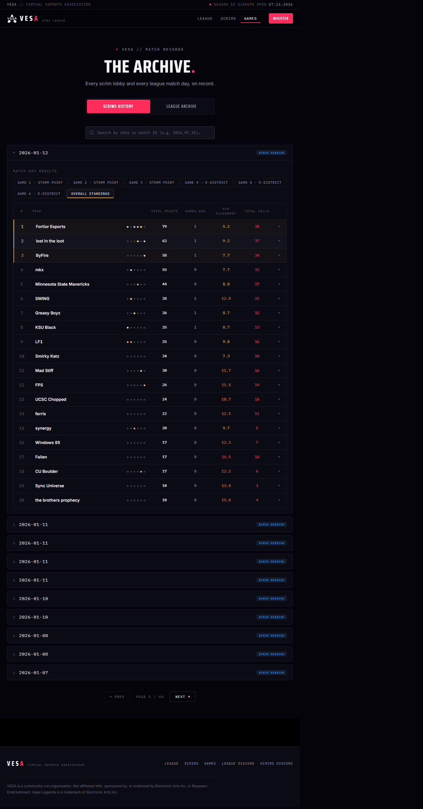
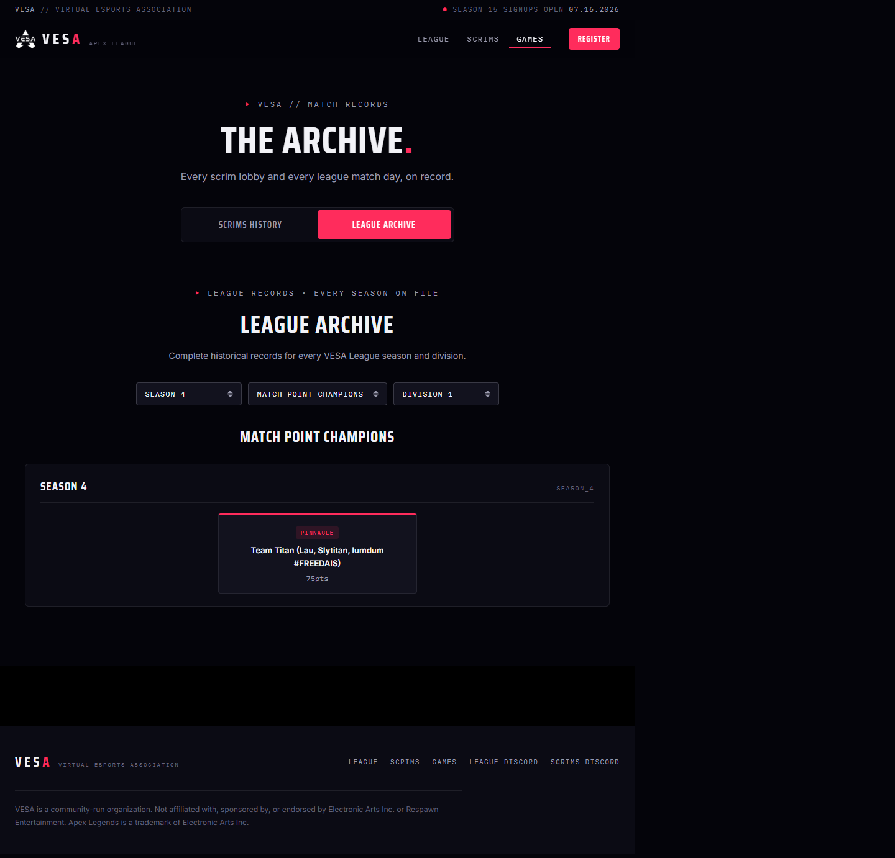
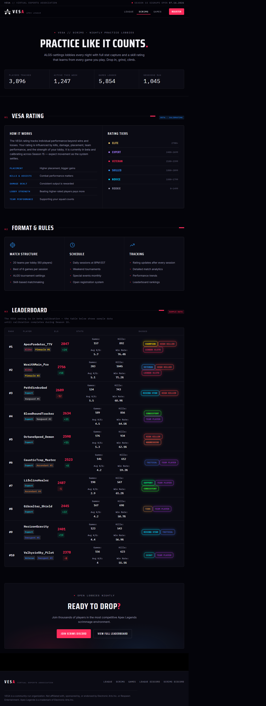
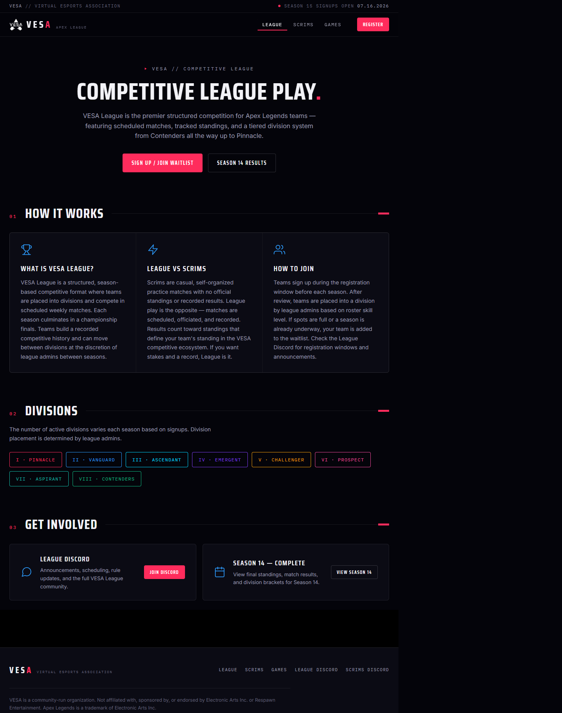
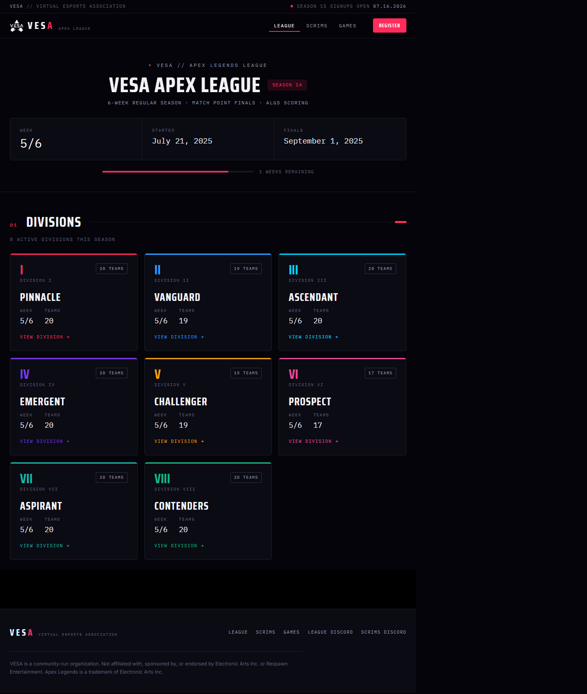
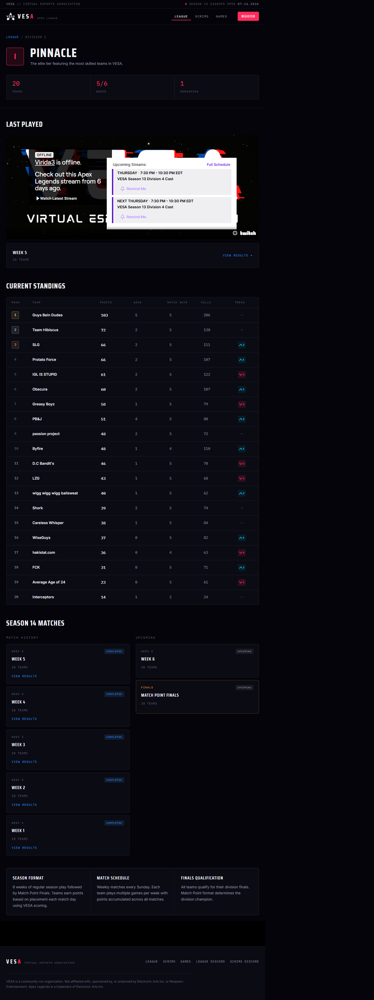
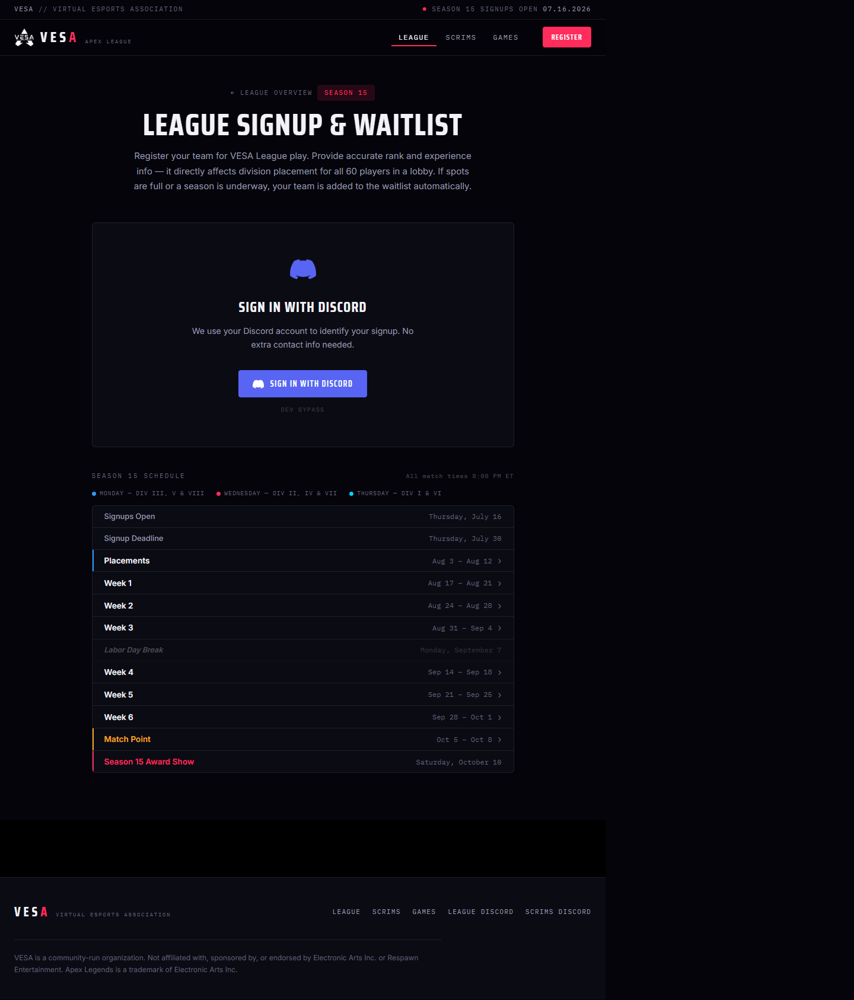

# VESA — Page Design Reference

> Full-page captures of the VESAWeb **Mission Control** UI redesign.  
> Captured 2026-07-07 · 1440×900 · `localhost:4200`

---

## Table of Contents

- [01 — Home](#01--home)
- [02A — Games: Scrims History (collapsed)](#02a--games-scrims-history-collapsed)
- [02B — Games: Scrim Expanded](#02b--games-scrim-expanded)
- [02C — Games: League Archive tab](#02c--games-league-archive-tab)
- [03 — Scrims](#03--scrims)
- [04 — League Overview](#04--league-overview)
- [05 — League: Current Season](#05--league-current-season)
- [06 — League: Division Detail (Pinnacle)](#06--league-division-detail-pinnacle)
- [07 — League Signup](#07--league-signup)
- [Notes](#notes)

---

## 01 — Home

**Route:** `/`

Landing page. Stats strip, hero section, recent activity feed, features showcase, Discord CTA. Stats are currently hardcoded — live data wiring tracked in [#34].

---

## 02A — Games: Scrims History (collapsed)

**Route:** `/games`

Default view. Full file index loaded on first visit, sorted newest-first. Client-side pagination (10 per page). Search bar filters the full in-memory index.

---

## 02B — Games: Scrim Expanded

**Route:** `/games` → open first scrim

Expanding a scrim row reveals the match day table: game tabs, per-game placement results, overall standings with podium stripes, and collapsible player stats.

---

## 02C — Games: League Archive tab

**Route:** `/games` → League Archive

Segmented control switches to the league archive view. Season / division / view-type dropdowns surface Match Point Champions, Season Standings, and Match History records.

---

## 03 — Scrims

**Route:** `/scrims`

Scrims hub. Join info, scrim format breakdown, ELO system explainer, leaderboard section. ELO leaderboard data strategy is an open decision ([#37]).

---

## 04 — League Overview

**Route:** `/league`

League hub. Format explainer, 8-division grid with links, Discord and results CTAs.

---

## 05 — League: Current Season

**Route:** `/league/current-season`

Season 14 results. Dynamically loads all 8 divisions from HuggingFace. Each division card shows team count, current week, and links to the division detail page.

---

## 06 — League: Division Detail (Pinnacle)

**Route:** `/league/pinnacle`

Division page. Standings table, per-week match history cards, live/last-played match section with Twitch embed. Match cards link to `/match/:id` results.

---

## 07 — League Signup

**Route:** `/league/signup`

Season 15 registration form. Discord OAuth gate (sign-in required before form is shown). Season 15 schedule widget below the form. Submission will wire to a Discord webhook once [#11] is complete.

---

## Notes

- **`/match/:id` not captured** — the Angular dev server returns 404 for routes ending in `.json` because `historyApiFallback` skips paths that look like files. The route works correctly when navigating from within the app via the Angular router.
- **`/players`, `/ratings`** — feature-flagged off, not captured.
- **Design system:** `src/styles.css` — VESA Mission Control token set (`--vesa-void`, `--vesa-panel`, `--vesa-red`, etc.). No glassmorphism; flat panels with 1px hairline borders.
